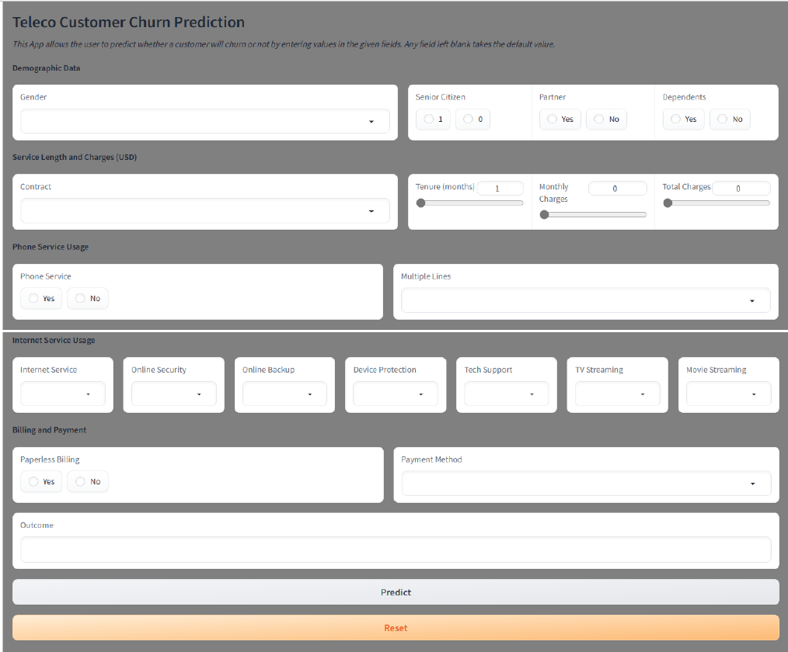
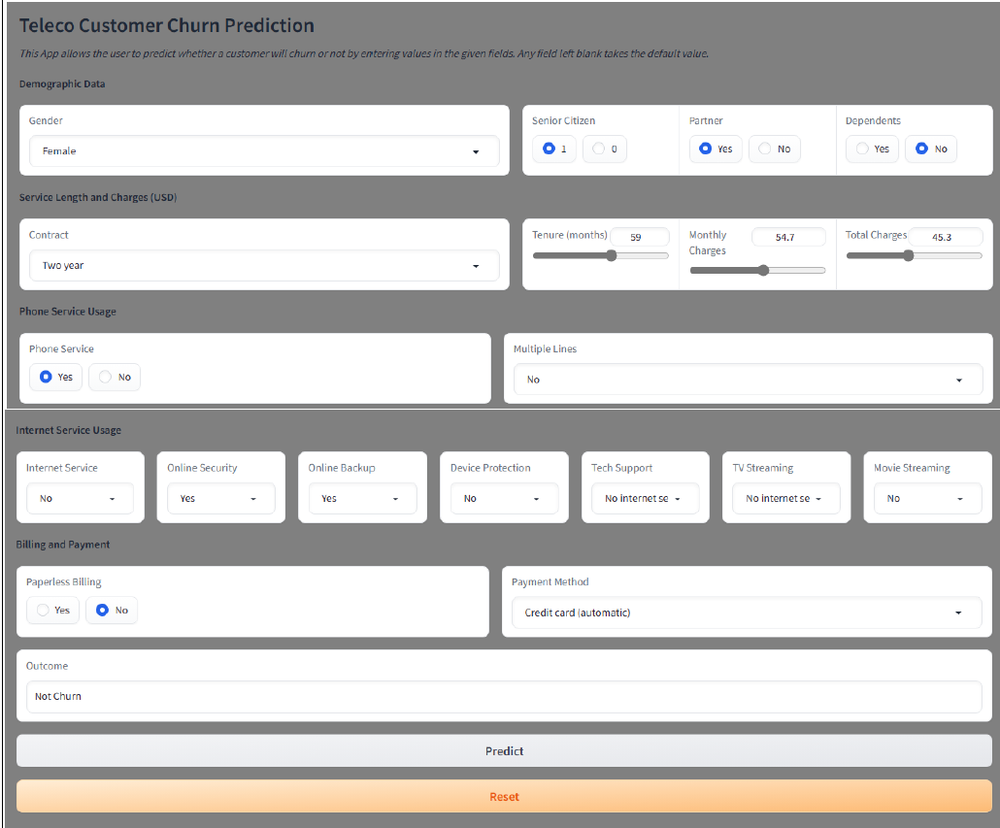

# Customer Churn Prediction App with Gradio
## Introduction
A Gradio-based churn prediction tool is based on a machine learning algorithm. This project is more of a quest to figure out how to integrate it into a web app with a user-friendly interface, in this case, Gradio. The goal is to create an interface that allows consumers to engage with an ML model independent of their level of expertise in machine learning.

## The Process
The procedure begins with exporting the essential items from the notebook, followed by correctly designing an interface, importing the necessary objects for modeling, and then writing the code to process inputs. The procedure can be summarized as follows:
- Import machine learning components into the app script.
- Create an interface,
- Create a function to handle inputs.
- Values are passed through the interface.
- Restore these values in the backend,
- Apply the required processing,
- To produce predictions, submit the processed values to the ML model.
- Process the acquired predictions and present them on the interface.

# Installation
To setup and run this project you need to have Python3 installed on your system. Then you can clone this repo. At the repo's root, use the code from below which applies:

- Windows:

  python -m venv venv; venv\Scripts\activate; python -m pip install -q --upgrade pip; python -m pip install -qr requirements.txt 

- How to run the application:
    In the Terminal type: python Churn_App.py

# Screenshots
| Churn_App default interface       | Churn_App with output           |
|-----------------------------------|---------------------------------|
|        |  |    

# Author
- Jacob O. Jaroya
- https://www.linkedin.com/in/jjaroya/
- https://huggingface.co/spaces/UholoDala/Churn_Prediction

